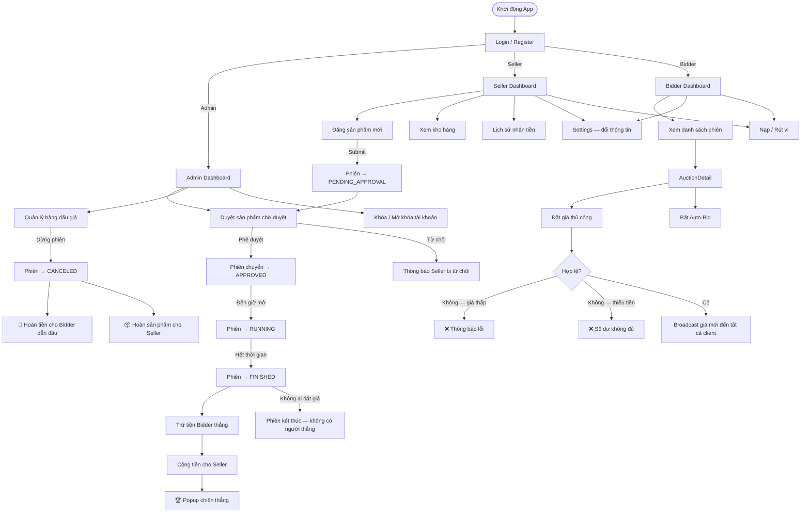

# 🏛️ BidPrecision — Hệ Thống Đấu Giá Trực Tuyến

> Bài tập lớn môn **Lập trình nâng cao** — Phát triển hệ thống đấu giá trực tuyến theo kiến trúc Client-Server.

---


#👥 Thành viên nhóm

| STT | Họ và tên           | MSSV       |
|-----|---------------------|-----------------------------|
| 1 | _Nguyễn Thanh Hiếu_ | _25020153_ | 
| 2 | _Hoàng Viết Hoàng_  | _25020160_ | 
| 3 | _Trần Tuấn Điệp_    | _25020123_ | 
| 4 | _Nguyễn Quang Huy_ | _25020183_ |

---

## 📋 Mô tả bài toán

**BidPrecision** là một hệ thống đấu giá trực tuyến đa người dùng hoạt động theo mô hình **Client-Server**. Người dùng có thể đăng ký, đăng sản phẩm đấu giá, tham gia đặt giá theo thời gian thực và thực hiện các giao dịch tài chính trong hệ thống.

### Phạm vi hệ thống

| Đối tượng | Vai trò |
|-----------|---------|
| **Admin** | Duyệt/từ chối sản phẩm, quản lý người dùng (ban/unban), xem tổng quan hệ thống |
| **Seller** | Đăng sản phẩm đấu giá, theo dõi kho hàng, xem lịch sử nhận tiền, nạp/rút ví |
| **Bidder** | Tham gia đấu giá thời gian thực, cài Auto-Bid tự động, nạp/rút ví |

Hệ thống hỗ trợ nhiều client kết nối đồng thời, xử lý tranh chấp đặt giá (concurrency), tự động kết thúc phiên và thanh toán cho người thắng.

---

## ⚙️ Công nghệ sử dụng

| Thành phần | Công nghệ |
|-----------|-----------|
| Ngôn ngữ | **Java 17+** |
| Giao diện | **JavaFX 21** (FXML + CSS Dark Theme) |
| Mạng | **Java Socket** (TCP/IP, port **8888**) |
| Truyền dữ liệu | **Java Object Serialization** (`ObjectInputStream`/`ObjectOutputStream`) |
| Build tool | **Apache Maven 3.6+** |
| Lưu trữ | File `.dat` (Java Serialization — không cần database) |
| Kiểm thử | **JUnit 5**, **Mockito** |

### Yêu cầu môi trường

- **JDK 17** trở lên (khuyến nghị JDK 17 LTS hoặc JDK 21 LTS)
- **Apache Maven 3.6+**
- Hệ điều hành: Windows 10+, macOS 11+, Ubuntu 20.04+

> 💡 **Kiểm tra phiên bản:**
> ```bash
> java -version    # Cần >= 17
> mvn -version     # Cần >= 3.6
> ```

---

## 📂 Cấu trúc thư mục

```
Online-Auction-System-Project/
│
├── pom.xml                          # Maven build config (Java 17, JavaFX 21)
├── auctions_data.dat                # Dữ liệu phiên đấu giá (tự sinh khi chạy)
├── users_data.dat                   # Dữ liệu người dùng (tự sinh khi chạy)
│
└── src/
    ├── main/
    │   ├── java/com/auction/
    │   │   ├── Main.java            # Entry point (khởi động JavaFX + kết nối server)
    │   │   ├── Launcher.java        # Wrapper tránh lỗi module JavaFX
    │   │   ├── App.java             # Màn hình khởi động (chọn Client/Server mode)
    │   │   │
    │   │   ├── server/
    │   │   │   ├── ServerApp.java   # Server chính (socket, scheduler, settlement)
    │   │   │   └── ClientHandler.java # Xử lý từng client trong luồng riêng
    │   │   │
    │   │   ├── client/
    │   │   │   └── NetworkClient.java # Client socket (singleton, auto-reconnect)
    │   │   │
    │   │   ├── model/               # Domain models (OOP)
    │   │   │   ├── User.java / Admin.java / Seller.java / Bidder.java
    │   │   │   ├── Auction.java     # Logic đấu giá, settlement, refund
    │   │   │   ├── Item.java / Art.java / Electronics.java / Vehicle.java
    │   │   │   ├── AuctionStatus.java / AuctionEarning.java
    │   │   │   ├── AutoBid.java / AutoBidRule.java
    │   │   │   └── WalletTransaction.java / BidTransaction.java
    │   │   │
    │   │   ├── controller/          # JavaFX Controllers (MVC)
    │   │   │   ├── LoginController.java / RegisterController.java
    │   │   │   ├── AdminController.java
    │   │   │   ├── SellerDashboardController.java
    │   │   │   ├── BidderDashboardController.java
    │   │   │   ├── AuctionDetailController.java
    │   │   │   ├── AuctionListController.java
    │   │   │   ├── SettingsController.java
    │   │   │   └── DepositWithdrawController.java
    │   │   │
    │   │   ├── protocol/            # Giao thức Client-Server
    │   │   │   ├── Request.java / Response.java
    │   │   │   ├── ActionType.java  # Danh sách hành động (LOGIN, PLACE_BID, ...)
    │   │   │   ├── StatusType.java  # SUCCESS / ERROR / UNAUTHORIZED
    │   │   │   └── AutoBidPayload.java / BidPayload.java / ...
    │   │   │
    │   │   ├── dao/                 # Data Access Object (lưu/đọc file)
    │   │   │   ├── IAuctionDAO.java / IGenericDAO.java
    │   │   │   └── impl/ AuctionDAOImpl.java / UserDAOImpl.java
    │   │   │
    │   │   ├── exception/           # Custom exceptions (7 loại)
    │   │   │   ├── AuctionException.java / AuctionClosedException.java
    │   │   │   ├── InvalidBidException.java / InsufficientBalanceException.java
    │   │   │   └── AuthenticationException.java / ...
    │   │   │
    │   │   └── utils/               # Tiện ích
    │   │       ├── AuctionManager.java  # Quản lý danh sách phiên (singleton)
    │   │       ├── UserManager.java     # Quản lý danh sách người dùng
    │   │       ├── AppContext.java      # Session người dùng hiện tại
    │   │       ├── CurrencyFormatter.java / NotificationUtil.java / UIUtils.java
    │   │       └── ItemFactory.java / ArtFactory.java / VehicleFactory.java
    │   │
    │   └── resources/com/auction/view/
    │       ├── Login.fxml / Register.fxml
    │       ├── AdminDashboard.fxml
    │       ├── SellerDashboard.fxml
    │       ├── BidderDashboard.fxml
    │       ├── AuctionDetail.fxml / AuctionList.fxml
    │       ├── Settings.fxml / DepositWithdraw.fxml
    │       └── fileCS/style.css     # Dark theme CSS toàn hệ thống
    │
    └── test/java/com/auction/
        ├── model/AuctionTest.java       # Unit test logic đấu giá
        ├── model/ConcurrencyTest.java   # Stress test đồng thời (15 luồng)
        ├── utils/AuctionManagerTest.java
        ├── utils/UserManagerTest.java
        └── dao/FileDataManagerTest.java
```

---

## 🚀 Hướng dẫn cài đặt và chạy

### Bước 1 — Tải dự án

```bash
git clone https://github.com/kaiki0201a/Online-Auction-System-Project.git
cd Online-Auction-System-Project
```

### Bước 2 — Build dự án

Chạy lệnh sau để tải dependencies và biên dịch (dùng chung cho mọi hệ điều hành):

```bash
mvn clean compile
```

---

### Bước 3 — Chạy Server ⚠️ (Phải chạy TRƯỚC)

> Server phải được khởi động **trước khi** mở bất kỳ client nào.

**Windows / macOS / Linux — tất cả dùng cùng lệnh:**

```bash
mvn exec:java -Dexec.mainClass="com.auction.server.ServerApp"
```

Khi server khởi động thành công, terminal sẽ hiển thị:

```
🚀 Server đang chạy trên cổng 8888...
```

---

### Bước 4 — Chạy Client (mở terminal mới)

**Windows / macOS / Linux — tất cả dùng cùng lệnh:**

```bash
mvn javafx:run
```

> 💡 Để mô phỏng nhiều người dùng: mở **nhiều terminal** và chạy `mvn javafx:run` ở mỗi terminal.

**Thứ tự vai trò khi test:**
1. Terminal 1: chạy **Server**
2. Terminal 2: đăng nhập **Admin** → duyệt sản phẩm
3. Terminal 3: đăng nhập **Seller** → đăng sản phẩm đấu giá
4. Terminal 4, 5, ...: đăng nhập **Bidder** → tham gia đấu giá

---

### Bước 5 — Chạy unit tests

```bash
mvn test
```

Kết quả mong đợi: **28 tests PASS**, 0 failures.

---

### Tài khoản mặc định có sẵn

| Vai trò | Username | Password |
|---------|----------|----------|
| Admin | `admin` | `123456` |
| Seller (mẫu) | `seller` | `123456` |
| Bidder (mẫu) | `bidder` | `123456` |

> Có thể đăng ký thêm tài khoản Seller/Bidder mới trực tiếp trong giao diện ứng dụng.

---

### Chạy bằng IDE (IntelliJ IDEA / Eclipse)

1. **File → Open** → chọn thư mục dự án (Maven project)
2. Đặt **JDK 17+** trong Project Structure → SDK
3. Tạo **Run Configuration** cho `com.auction.server.ServerApp` → **chạy trước**
4. Tạo **Run Configuration** cho `com.auction.Launcher` → chạy client
5. Nếu IntelliJ báo lỗi JavaFX module, thêm VM options:
   ```
   --module-path /path/to/javafx-sdk/lib --add-modules javafx.controls,javafx.fxml
   ```

---

## ✅ Danh sách chức năng đã hoàn thành

### 3.1 Chức năng bắt buộc

#### 3.1.1 Quản lý người dùng
- [x] Đăng ký tài khoản (Seller / Bidder) với validation
- [x] Đăng nhập / Đăng xuất an toàn
- [x] Chỉnh sửa hồ sơ cá nhân (email, mật khẩu)
- [x] Nạp tiền / Rút tiền vào ví điện tử
- [x] Admin ban / unban / khôi phục tài khoản

#### 3.1.2 Quản lý sản phẩm đấu giá
- [x] Seller đăng sản phẩm (3 danh mục: Art, Electronics, Vehicle)
- [x] Tải ảnh minh họa sản phẩm từ file cục bộ
- [x] Đặt thời gian bắt đầu / kết thúc linh hoạt
- [x] Admin duyệt hoặc từ chối sản phẩm kèm lý do
- [x] Seller xem kho hàng với badge trạng thái (Draft / Live / Sold / Canceled)
- [x] Seller / Admin hủy phiên đấu giá

#### 3.1.3 Tham gia đấu giá
- [x] Xem danh sách toàn bộ phiên (lọc theo danh mục, trạng thái)
- [x] Tìm kiếm theo tên sản phẩm **và** tên người bán
- [x] Sắp xếp: Mới nhất / Giá cao / Giá thấp (toggle)
- [x] Đặt giá thủ công với validation realtime
- [x] Đặt giá nhanh (+10% / +50% / +100%)
- [x] Lịch sử đặt giá và biểu đồ đường tiến trình giá (LineChart)
- [x] Đồng hồ đếm ngược thời gian còn lại
- [x] Popup thông báo thắng/thua khi phiên kết thúc

#### 3.1.4 Kết thúc phiên đấu giá
- [x] Tự động kết thúc đúng giờ (ScheduledExecutorService)
- [x] Chuyển tiền tự động: trừ của Bidder thắng, cộng cho Seller
- [x] Seller xem lịch sử nhận tiền (bảng thanh toán chi tiết)
- [x] Hoàn tiền cho tất cả Bidder khi phiên bị hủy giữa chừng
- [x] Broadcast realtime đến toàn bộ client đang theo dõi phiên

#### 3.1.5 Xử lý lỗi & ngoại lệ
- [x] 7 loại Custom Exception phân cấp rõ ràng
- [x] Tự động kết nối lại khi mất mạng (auto-reconnect, tối đa 5 lần)
- [x] Thread-safe với `synchronized` và `CopyOnWriteArrayList`
- [x] Guard chống double-settlement (không trừ/cộng tiền 2 lần)
- [x] Validation đầu vào cả phía client và server

#### 3.1.6 Giao diện người dùng (GUI)
- [x] Dark theme toàn hệ thống (palette vàng-đen premium)
- [x] Sidebar navigation với hover effect và active highlight
- [x] Toast notification (thông báo nổi tự biến mất sau 3 giây)
- [x] Responsive layout — ScrollPane cuộn tự động
- [x] Toggle hiển thị/ẩn mật khẩu (nút mắt)

### 3.2 Chức năng nâng cao

#### 3.2.1 Auto-Bidding (Đấu giá tự động)
- [x] Cài Max Bid (giá tối đa) và Increment (bước tăng)
- [x] Server tự động đặt giá thay Bidder khi bị vượt giá
- [x] Nhiều Bidder cài Auto-Bid đồng thời — giải quyết tranh chấp tuần tự
- [x] Tự động tắt khi chạm giới hạn Max Bid
- [x] Hiển thị trạng thái Auto-Bid trên giao diện

#### 3.2.2 Xử lý đồng thời (Concurrency)
- [x] Multi-threaded server — mỗi client một luồng riêng
- [x] Stress test: 15 luồng đặt giá đồng thời — không race condition
- [x] `synchronized` bảo vệ `settleAuction()` và `placeBid()`
- [x] `ScheduledExecutorService` cho auto-close và auto-live scheduler

#### 3.2.3 Tính năng UI/UX nâng cao
- [x] Click avatar → mở Cài Đặt (Seller & Bidder)
- [x] Popup chiến thắng với animation scale-in khi thắng đấu giá
- [x] Gợi ý định giá sản phẩm theo danh mục (dialog hướng dẫn)
- [x] "Quên mật khẩu?" dẫn đến dialog hướng dẫn liên hệ Admin
- [x] Admin xem thống kê tổng quan (users, phiên active, doanh thu)

---

## 📊 Kiến trúc hệ thống

```
┌──────────────────────────────────────────────────────────────────┐
│                       SERVER (port 8888)                         │
│  ┌─────────────┐  ┌──────────────────┐  ┌────────────────────┐  │
│  │  ServerApp  │  │  ClientHandler   │  │  ScheduledExecutor │  │
│  │ (Main loop) │  │  (per-thread)    │  │  (auto-close/live) │  │
│  └──────┬──────┘  └────────┬─────────┘  └────────┬───────────┘  │
│         │                  │                      │              │
│  ┌──────▼──────────────────▼──────────────────────▼───────────┐  │
│  │         AuctionManager (singleton)  │  UserManager          │  │
│  │         AuctionDAOImpl (file I/O)   │  UserDAOImpl           │  │
│  └───────────────────────────────────────────────────────────┘  │
└─────────────────────────┬────────────────────────────────────────┘
                          │  TCP Socket — Java Serialization
             ┌────────────┼─────────────┐
             ▼            ▼             ▼
      ┌────────────┐ ┌────────────┐ ┌────────────┐
      │  Client 1  │ │  Client 2  │ │  Client N  │
      │  (Admin)   │ │  (Seller)  │ │  (Bidder)  │
      │ JavaFX GUI │ │ JavaFX GUI │ │ JavaFX GUI │
      └────────────┘ └────────────┘ └────────────┘
```

---

## 🗺️ Sơ đồ Luồng Màn Hình (Screen Navigation Flow)

> Ứng dụng desktop (JavaFX) — không có URL. Sơ đồ dưới mô tả luồng điều hướng giữa các màn hình theo vai trò người dùng.

```
                        ┌─────────────────────────┐
                        │       Màn hình App       │
                        │  (Khởi động ứng dụng)   │
                        └────────────┬────────────┘
                                     │
                        ┌────────────▼────────────┐
                        │     Màn hình Login       │ ◄──────────────────────┐
                        │  (login / register)      │                        │
                        └──────────┬──────────────┘                        │
                      ┌────────────┼─────────────────┐                     │
              [Admin] │    [Seller]│          [Bidder]│                     │
                      │            │                  │                     │
         ┌────────────▼──┐  ┌──────▼──────┐  ┌───────▼──────┐             │
         │ AdminDashboard│  │   Seller     │  │   Bidder     │             │
         │               │  │  Dashboard  │  │  Dashboard   │             │
         │ ┌───────────┐ │  │             │  │              │             │
         │ │Duyệt SP   │ │  │ ┌─────────┐ │  │ ┌──────────┐ │             │
         │ │Bảng Auct. │ │  │ │Kho hàng │ │  │ │Danh sách │ │             │
         │ │Quản lý    │ │  │ │Đăng SP  │ │  │ │phiên đấu │ │             │
         │ │  User     │ │  │ │Lịch sử  │ │  │ │giá       │ │             │
         │ └─────┬─────┘ │  │ │  tiền   │ │  │ └────┬─────┘ │             │
         └───────┼───────┘  │ └────┬────┘ │  └──────┼───────┘             │
                 │           └──────┼──────┘         │                     │
                 │                  │                 │                     │
                 │           ┌──────▼──────────────────▼──────┐            │
                 │           │       AuctionDetail             │            │
                 └──────────►│  (Chi tiết phiên — đặt giá,    │            │
                             │   biểu đồ, countdown, AutoBid)  │            │
                             └────────────────────────────────┘            │
                                                                            │
         ┌──────────────────┐   ┌──────────────────┐                       │
         │    Settings      │   │  DepositWithdraw  │                       │
         │ (Đổi mật khẩu,  │   │  (Nạp / Rút ví)  │                       │
         │  cập nhật email) │   └──────────────────┘                       │
         └──────────────────┘                                               │
                                                                            │
         [Đăng xuất từ bất kỳ màn hình nào] ──────────────────────────────►┘
```

### Luồng nghiệp vụ chính



---

## 📎 Tài liệu & Video Demo

| Tài nguyên | Đường dẫn |
|-----------|-----------|
| 📄 Báo cáo PDF | _https://drive.google.com/file/d/1pWpfG3nknAk-ad-wYdwFQufUQa3XeGsD/view?usp=sharing_ |
| 🎬 Video demo | _[Thêm link YouTube / Google Drive video demo tại đây]_ |
