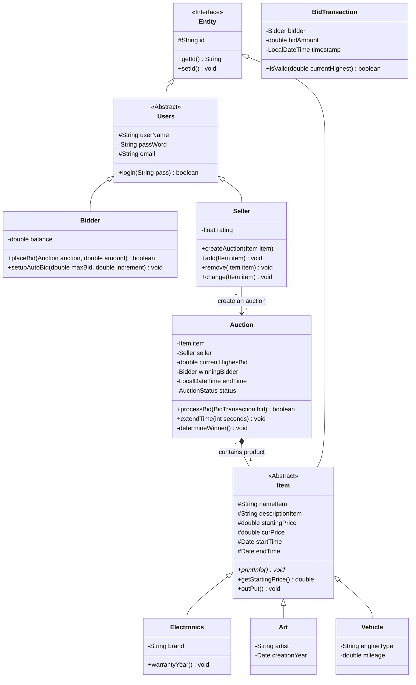

# Online-Auction-System-Project

```mermaid
classDiagram
	%% Base, Item
	class Entity{
		<<Interface>>
		#String id
		+getId() String
		+setId() void
	}
	class Item{
		<<Abstract>>
		#String nameItem
		#String descriptionItem
		#double startingPrice
		#double curPrice
		#Date startTime
		#Date endTime
		+printInfo()* void
		+getStartingPrice() double
		%% Ket thuc dau gia
		+outPut() void
	}
	class Electronics{
		-String brand
		+warrantyYear() void
	}
	class Art{
		-String artist
		-Date creationYear
	}
	class Vehicle{
		-String engineType
		%% So km da di
		-double mileage
	}
	%% Users
	class Users{
		<<Abstract>>
		#String userName
		-String passWord
		#String email
		+login(String pass) boolean
	}
	class Bidder{
		-double balance
		%% PT de nguoi dung thao tac tren giao dien
		+placeBid(Auction auction, double amount) boolean
		
		%% Thiet lap dau gia tu dong
		+setupAutoBid(double maxBid, double increment) void
	}
	
	class Seller{
		%% Diem uy tin
		-float rating
		%%PT cong khai dau gia
		+createAuction(Item item)
		+add(Item item) void
		+remove(Item item) void
		+change(Item item) void
	}
	
	%% Business Logic
	class Auction{
		-Item item
		-Seller seller
		-double currentHighesBid
		-Bidder winningBidder
		-LocalDateTime endTime
		-AuctionStatus status
		%% Đảm bảo an toàn luồng
		+processBid(BidTransaction bid) boolean
		+extendTime(int seconds) void
		-determineWinner() void
	}
	%% Lưu trữ một lượt đặt giá
	class BidTransaction{
		%% Giao dich duoc tao ra
		-Bidder bidder
		-double bidAmount
		%% Thoi diem dat gia
		-LocalDateTime timestamp
		+isValid(double currentHighest) boolean
	}
	
	
	%% The hien moi quan he
	Entity <|-- Users
	Entity <|-- Item
	
	Users <|-- Bidder
	Users <|-- Seller
	
	Item <|-- Electronics
	Item <|-- Art
	Item <|-- Vehicle
	
	Seller "1" --> "*" Auction: create an auction
	Auction "1" *-- "1" Item: contains product
```
