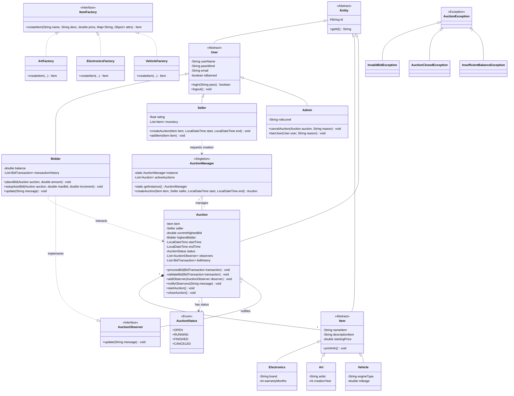

# Online-Auction-System-Project

```mermaid
classDiagram
    %% Base Entity
    class Entity{
       <<Abstract>>
       #String id
       +getId() String
    }

    %% Items Hierarchy
    class Item{
       <<Abstract>>
       -String nameItem
       -String descriptionItem
       -double startingPrice
       +printInfo()* void
    }
    class Electronics{
       -String brand
       -int warrantyMonths
    }
    class Art{
       -String artist
       -int creationYear
    }
    class Vehicle{
       -String engineType
       -double mileage
    }

    %% Users Hierarchy
    class User{
       <<Abstract>>
       -String userName
       -String passWord
       -String email
       -boolean isBanned
       +login(String pass) boolean
       +logout() void
    }
    
    %% Observer Interface
    class AuctionObserver {
        <<Interface>>
        +update(String message) void
    }

    class Bidder{
       -double balance
       -List~BidTransaction~ transactionHistory
       +placeBid(Auction auction, double amount) void
       +setupAutoBid(Auction auction, double maxBid, double increment) void
       +update(String message) void
    }
    
    class Seller{
       -float rating
       -List~Item~ inventory
       +createAuction(Item item, LocalDateTime start, LocalDateTime end) void
       +addItem(Item item) void
    }
    
    class Admin{
       -String roleLevel
       +cancelAuction(Auction auction, String reason) void
       +banUser(User user, String reason) void
    }

    %% Business Logic
    class Auction{
       -Item item
       -Seller seller
       -double currentHighestBid
       -Bidder highestBidder
       -LocalDateTime startTime
       -LocalDateTime endTime
       -AuctionStatus status
       -List~AuctionObserver~ observers
       -List~BidTransaction~ bidHistory
       +processBid(BidTransaction transaction) void
       -validateBid(BidTransaction transaction) void
       +addObserver(AuctionObserver observer) void
       +notifyObservers(String message) void
       +startAuction() void
       +closeAuction() void
    }

    %% Design Patterns & Utils
    class AuctionManager {
       <<Singleton>>
       -static AuctionManager instance
       -List~Auction~ activeAuctions
       +static getInstance() AuctionManager
       +createAuction(Item item, Seller seller, LocalDateTime start, LocalDateTime end) Auction
    }

    class ItemFactory {
        <<Interface>>
        +createItem(String name, String desc, double price, Map~String, Object~ attrs) Item
    }
    class ArtFactory { +createItem(...) Item }
    class ElectronicsFactory { +createItem(...) Item }
    class VehicleFactory { +createItem(...) Item }

    %% Enums
    class AuctionStatus{
       <<Enum>>
       +OPEN
       +RUNNING
       +FINISHED
       +CANCELED
    }

    %% Exceptions
    class AuctionException { <<Exception>> }
    class InvalidBidException { }
    class AuctionClosedException { }
    class InsufficientBalanceException { }

    %% Relationships
    Entity <|-- User
    Entity <|-- Item
    Entity <|-- Auction

    User <|-- Bidder
    User <|-- Seller
    User <|-- Admin
    
    AuctionObserver <|.. Bidder : implements
    
    Item <|-- Electronics
    Item <|-- Art
    Item <|-- Vehicle

    ItemFactory <|.. ArtFactory
    ItemFactory <|.. ElectronicsFactory
    ItemFactory <|.. VehicleFactory

    AuctionException <|-- InvalidBidException
    AuctionException <|-- AuctionClosedException
    AuctionException <|-- InsufficientBalanceException

    Auction "1" *-- "1" Item
    Auction "1" --> "1" AuctionStatus : has status
    Auction "1" o-- "*" AuctionObserver : notifies
    AuctionManager "1" o-- "*" Auction : manages
    Seller ..> AuctionManager : requests creation
    Bidder ..> Auction : interacts
 
```
