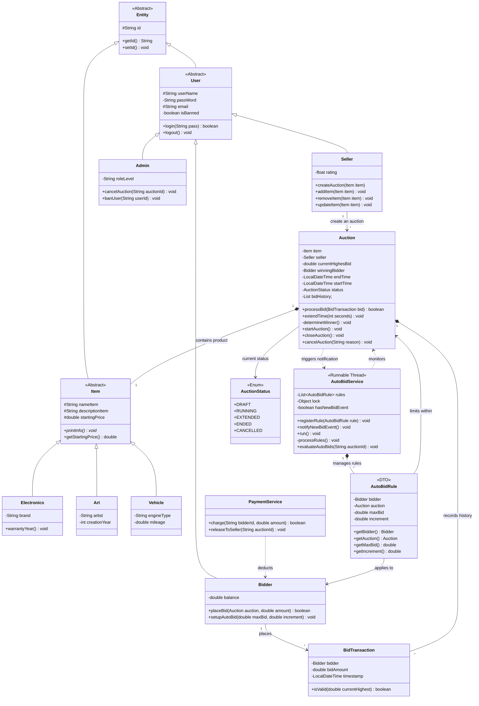

# Online-Auction-System-Project

```mermaid
classDiagram
	%% Base, Item
	class Entity{
		<<Abstract>>
		#String id
		+getId() String
		+setId() void
	}
	class Item{
		<<Abstract>>
		#String nameItem
		#String descriptionItem
		#double startingPrice
		+printInfo()* void
		+getStartingPrice() double
	}
	class Electronics{
		-String brand
		+warrantyYear() void
	}
	class Art{
		-String artist
		-int creationYear
	}
	class Vehicle{
		-String engineType
		%% So km da di
		-double mileage
	}
	%% Users
	class User{
		<<Abstract>>
		#String userName
		-String passWord
		#String email
		-boolean isBanned
		+login(String pass) boolean
		+logout() void
	}
	class Bidder{
		-double balance
		%% PT de nguoi dung thao tac tren giao dien
		+placeBid(Auction auction, double amount) boolean
		
		%% Thiet lap dau gia tu dong
		+setupAutoBid(double maxBid, double increment) void
	}
	
	class Seller{
		%% Diem uy tin
		-float rating
		%%PT cong khai dau gia
		+createAuction(Item item)
		+addItem(Item item) void
		+removeItem(Item item) void
		+updateItem(Item item) void
	}
	class Admin{
		-String roleLevel
		+cancelAuction(String auctionId) void
		+banUser(String userId) void
	}
	
	%% Business Logic
	class Auction{
		-Item item
		-Seller seller
		-double currentHighesBid
		-Bidder winningBidder
		-LocalDateTime endTime
		-LocalDateTime startTime
		-AuctionStatus status
		-List<BidTransaction> bidHistory;
		%% Đảm bảo an toàn luồng
		+processBid(BidTransaction bid) boolean
		+extendTime(int seconds) void
		-determineWinner() void
		+startAuction() void
		+closeAuction() void
		+cancelAuction(String reason) void
	}
	
	%% Tầng Service & Đa luồng (MỚI BỔ SUNG)
	class AutoBidRule {
		<<DTO>>
		-Bidder bidder
		-Auction auction
		-double maxBid
		-double increment
		+getBidder() Bidder
		+getAuction() Auction
		+getMaxBid() double
		+getIncrement() double
	}
	
	class AutoBidService {
		<<Runnable Thread>>
		-List~AutoBidRule~ rules
		-Object lock
		-boolean hasNewBidEvent
		+registerRule(AutoBidRule rule) void
		+notifyNewBidEvent() void
		+run() void
		-processRules() void
	}
	%% Lưu trữ một lượt đặt giá
	class BidTransaction{
		%% Giao dich duoc tao ra
		-Bidder bidder
		-double bidAmount
		%% Thoi diem dat gia
		-LocalDateTime timestamp
		+isValid(double currentHighest) boolean
	}
	%% Services (conceptual)
	class AutoBidService {
		+evaluateAutoBids(String auctionId) void
	}
	class PaymentService {
		+charge(String bidderId, double amount) boolean
		+releaseToSeller(String auctionId) void
	}
	
	%% Enums
	class AuctionStatus{
		<<Enum>>
		+DRAFT
		+RUNNING
		+EXTENDED
		+ENDED
		+CANCELLED
	}
	
	%% The hien moi quan he
	Entity <|-- User
	Entity <|-- Item
	
	User <|-- Bidder
	User <|-- Seller
	User <|-- Admin
	
	Item <|-- Electronics
	Item <|-- Art
	Item <|-- Vehicle
	
	%% Moi quan he ket hop
	Seller "1" --> "*" Auction: create an auction
	Bidder "1" --> "*" BidTransaction: places
	%% Moi quan he cau thanh
	Auction "1" *-- "1" Item: contains product
	Auction "1" *-- "*" BidTransaction: records history
	%% Sự phụ thuộc
	Auction --> AuctionStatus: current status
	%% Su phu thuoc cua cac Service
	PaymentService ..> Bidder : deducts
	AutoBidService ..> Auction : monitors
	%% Mối quan hệ hệ thống Auto-Bid (MỚI)
	AutoBidService "1" *-- "*" AutoBidRule : manages rules
	AutoBidRule --> Bidder : applies to
	AutoBidRule --> Auction : limits within
	Auction ..> AutoBidService : triggers notification
```
